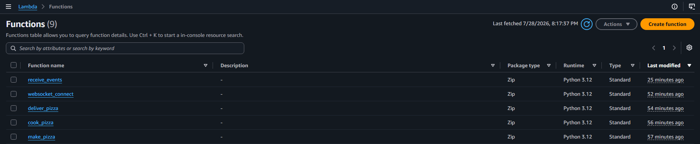
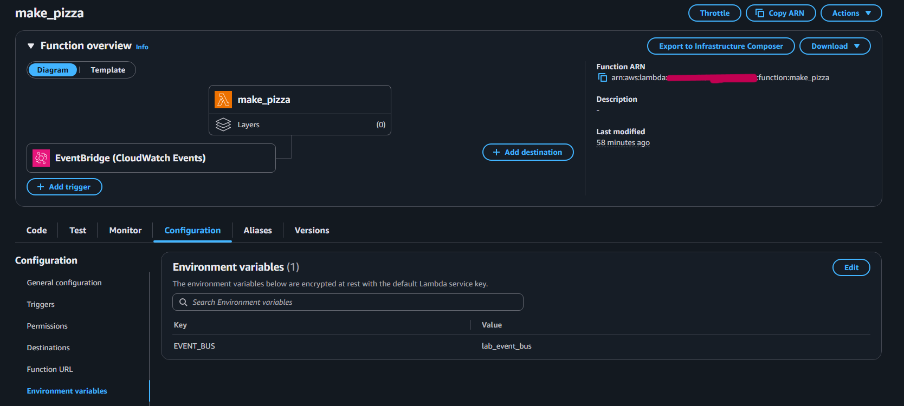
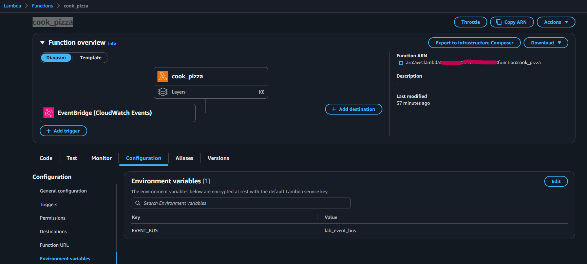
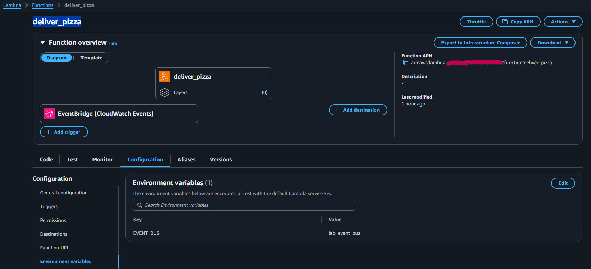
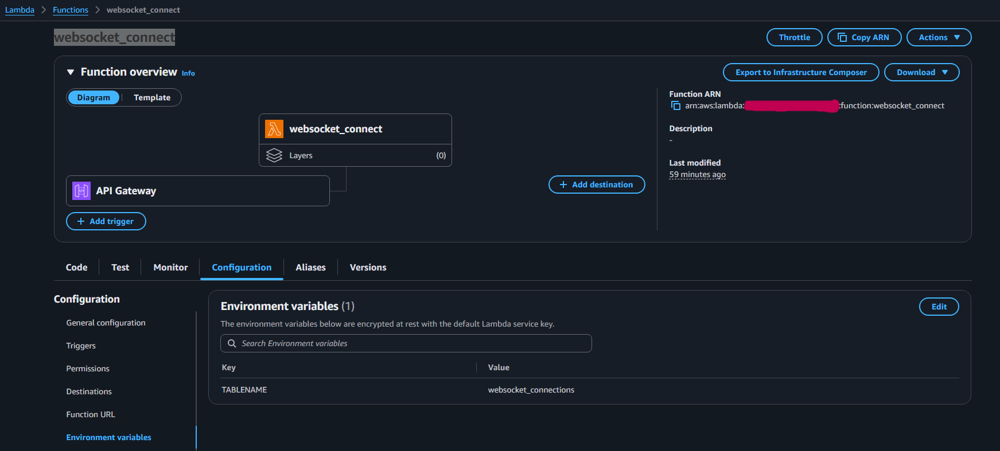
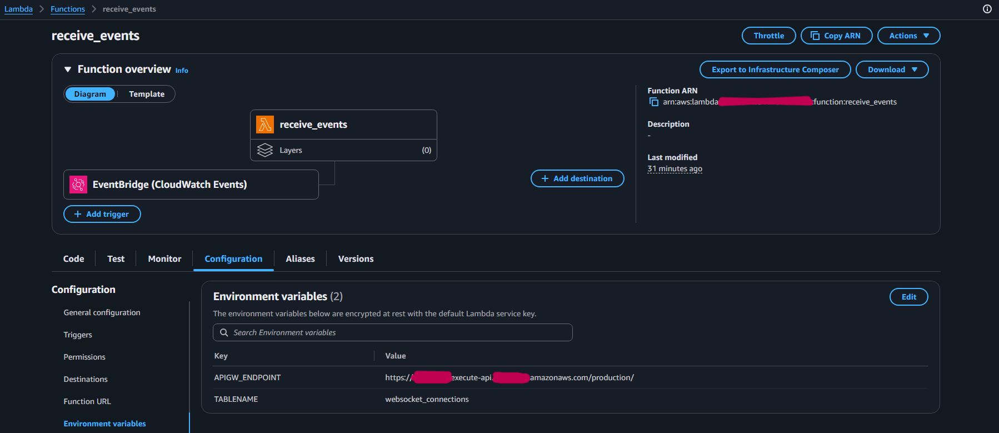
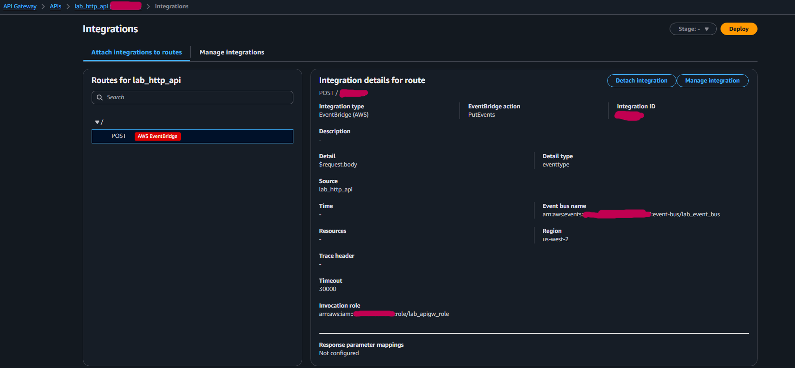
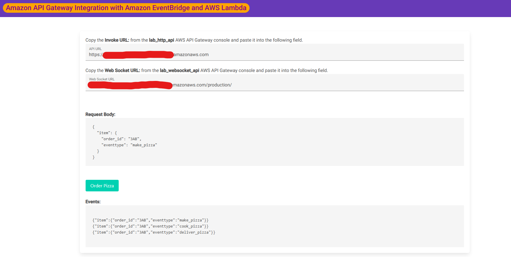

## Overview

This project demonstrates a fully serverless, event-driven architecture built on AWS designed to process asynchronous workflows in real time. Using a pizza ordering scenario, the system decouples API requests from background processing workers, updating order states sequentially while broadcasting real-time status changes back to the client application via WebSockets.

---

## Why Use Each Tool?

- **Amazon API Gateway (HTTP API)**: Provides a low-latency, cost-effective endpoint for RESTful request ingestion. Integrates directly with EventBridge without requiring intermediate compute code.
- **Amazon API Gateway (WebSocket API)**: Enables persistent, bi-directional communication, allowing the server to push real-time order updates to the client without polling.
- **Amazon EventBridge**: Serves as the central event bus, decoupling producers from consumers and routing events dynamically using declarative JSON pattern matching.
- **AWS Lambda**: Executes lightweight, stateless compute logic for event transformation and status management, scaling automatically per invocation.
- **Amazon DynamoDB**: Stores active WebSocket session mappings (`order_id` to `connection_id`) with single-digit millisecond latency.

---


## Event Schema Structure

In Amazon EventBridge, all envelope fields are standardized. Custom payload properties are wrapped inside the `detail` object. Below is the envelope structure generated when an order event is published to `lab_event_bus`:

```json
{
  "version": "0",
  "id": "e3f12a84-7c30-4b82-bc10-983dfa2890ac",
  "detail-type": "eventtype",
  "source": "lab_http_api",
  "account": "123456789012",
  "time": "2026-07-28T22:15:00Z",
  "region": "us-west-2",
  "resources": [],
  "detail": {
    "item": {
      "order_id": "3AB",
      "eventtype": "make_pizza"
    }
  }
}
```

Envelope Fields Breakdown:
- source: Identifies the service or application that generated the event (e.g., lab_http_api, make_pizza, cook_pizza).
- detail-type: Categorizes the event payload for pattern matching (configured as eventtype).
- detail: The custom JSON payload containing order specifics (order_id, eventtype).
- time: ISO-8601 timestamp representing when the event occurred.
- resources: Optional array of AWS ARNs involved in the event context.

---

## Architecture Diagram


---

## Key Objectives

- Implement an event-driven pattern using EventBridge custom buses and rules.
- Integrate API Gateway directly with AWS services (EventBridge) without proxy Lambdas.
- Manage persistent WebSocket connections for real-time frontend updates.
- Demonstrate both sequential event chaining and concurrent fan-out patterns.
- Store and query session metadata using DynamoDB.

---

### Step 1: Compute Layer Setup (AWS Lambda)

The compute layer consists of five microservices developed in Python 3.12, located in the [`lambda/`](./lambda/) directory. Each function has a single responsibility within the asynchronous pipeline:

- [`lambda/make_pizza.py`](./lambda/make_pizza.py): Initiates order processing by setting the status to `cook_pizza` and publishing a new event to EventBridge.
- [`lambda/cook_pizza.py`](./lambda/cook_pizza.py): Advances order state from cooking to `deliver_pizza` and emits the updated event back to the bus.
- [`lambda/deliver_pizza.py`](./lambda/deliver_pizza.py): Completes the sequential workflow by emitting the final `delivered` event.
- [`lambda/websocket_connect.py`](./lambda/websocket_connect.py): Handles the WebSocket `$connect` route, persisting session mappings (`order_id` to `connection_id`) in Amazon DynamoDB.
- [`lambda/receive_events.py`](./lambda/receive_events.py): Broadcasts real-time state changes (`make_pizza`, `cook_pizza`, `deliver_pizza`, `delivered`) back to the client via WebSocket using API Gateway Management API.

**Key Configuration Details:**
1. Configured IAM execution roles for least-privilege access to EventBridge, DynamoDB, and API Gateway Management API.
2. Defined environment variables (`EVENT_BUS`, `TABLENAME`, `APIGW_ENDPOINT`) to decouple infrastructure parameters from function code.

### Step 2: Event Bus & Routing Rules (Amazon EventBridge)
1. Provisioned custom event bus `lab_event_bus`.
2. Created pattern-matching rules for sequential state updates:
   - `lab_make_pizza_rule` -> Targets `make_pizza` Lambda.
   - `lab_cook_pizza_rule` -> Targets `cook_pizza` Lambda.
   - `lab_deliver_pizza_rule` -> Targets `deliver_pizza` Lambda.
3. Created `lab_receive_events_rule` matching all event types to trigger `receive_events` concurrently (fan-out pattern).

### Step 3: API Gateway & Frontend Integration
1. Configured HTTP API (`lab_http_api`) with a `POST` route mapped directly to EventBridge `PutEvents`.
2. Enabled CORS configuration (`*` origins, `POST` method) to allow web client execution.
3. Created WebSocket API (`lab_websocket_api`) with `$connect` route pointing to `websocket_connect` Lambda.
4. Deployed WebSocket API and updated `receive_events` Lambda with the `@connections` management endpoint URL.

---

## Deployment & Verification Screenshots

### 1. Compute Layer (AWS Lambda)
- **Functions Overview**: All 5 microservices deployed using Python 3.12 runtime.
  
  

- **Sequential Processing Lambdas**: Configuration and environment variables (`EVENT_BUS=lab_event_bus`) for `make_pizza`, `cook_pizza`, and `deliver_pizza`.
  
  | `make_pizza` | `cook_pizza` | `deliver_pizza` |
  | :---: | :---: | :---: |
  |  |  |  |

- **WebSocket Session Management Lambdas**: `websocket_connect` storing sessions in DynamoDB, and `receive_events` configured with `APIGW_ENDPOINT` to broadcast events back to clients.
  
  | `websocket_connect` | `receive_events` |
  | :---: | :---: |
  |  |  |

---

### 2. Event Routing (Amazon EventBridge)
- **Rules on Custom Event Bus**: Active rules matching pattern attributes on `lab_event_bus`.
  
  

- **Event Bus Metrics & Monitoring**: Metric graphs demonstrating successful event publishing, latency, and function invocations.
  
  

---

### 3. API Ingestion & Real-Time Gateway (Amazon API Gateway)
- **APIs Overview**: HTTP API for RESTful order entry and WebSocket API for persistent client connections.
  
  

- **Direct EventBridge Integration**: Route `POST /` mapped directly to EventBridge `PutEvents` action without intermediary compute code.
  
  

- **WebSocket Route Setup**: Route `$connect` mapped directly to the `websocket_connect` Lambda function.
  
  

- **CORS Configuration**: Cross-Origin Resource Sharing enabled for frontend client access.
  
  

---

### 4. End-to-End Application Testing
- **Real-Time Order Flow**: Web application connecting to the WebSocket API, submitting an HTTP POST order, and receiving live status updates (`make_pizza` -> `cook_pizza` -> `deliver_pizza` -> `delivered`) as events are published and processed asynchronously.

  
  ---

## Cost Analysis & FinOps Considerations

### Estimated Cost to Reproduce: **~$0.00 USD**

This architecture runs 100% on a serverless, pay-per-use model and fits well within the **AWS Free Tier**:

- **Amazon API Gateway**:
  - *HTTP API*: $1.00 per million requests (First 1M free/month).
  - *WebSocket API*: $1.00 per million messages + connection minutes.
- **Amazon EventBridge**: $1.00 per million custom events published (First 1M free/month).
- **AWS Lambda**: Charged per request volume and duration (GB-seconds), covered by the 1M free requests/month.
- **Amazon DynamoDB**: On-Demand capacity model costing $0.00 for idle storage and minimal lab reads/writes.

---

## Infrastructure as Code with AWS CloudFormation

This lab includes an automated deployment template designed to easily reproduce the event-driven environment using AWS CloudFormation.

The template [`./template.yaml`](https://github.com/GiovaniSerra/aws-labs/tree/main/aws-event-driven-architecture/templates). provisions all core lab resources, including DynamoDB session mapping, an EventBridge custom bus with rules, IAM roles with scoped permissions, Python 3.12 Lambdas, and API Gateway (HTTP & WebSocket APIs).

### Quick Deployment via AWS CLI

```bash
# 1. Validate template syntax
aws cloudformation validate-template --template-body file://infrastructure/template.yaml

# 2. Deploy the stack
aws cloudformation deploy \
  --template-file infrastructure/template.yaml \
  --stack-name aws-event-driven-architecture-stack \
  --capabilities CAPABILITY_IAM

# 3. Retrieve endpoint URLs for testing
aws cloudformation describe-stacks \
  --stack-name aws-event-driven-architecture-stack \
  --query "Stacks[0].Outputs"

```

## Cost Analysis & FinOps Considerations

> *Note: Pricing shown is based on the AWS pricing model available at the time this lab was created and may change over time.*

Estimated Cost to Reproduce: ~$0.00 USD
This architecture runs 100% on a serverless, pay-per-use model and fits well within the AWS Free Tier:

* **Amazon API Gateway:**
  * HTTP API: $1.00 per million requests (First 1M free/month).
  * WebSocket API: $1.00 per million messages + connection minutes.
* **Amazon EventBridge:** $1.00 per million custom events published (First 1M free/month).
* **AWS Lambda:** Charged per request volume and duration (GB-seconds), covered by the 1M free requests/month.
* **Amazon DynamoDB (On-Demand):** Costs are minimal for this lab due to the very small storage footprint and low request volume.

### Key Financial Takeaways

* **Zero Idle Cost:** No servers, load balancers, or containers running when no orders are being placed.
* **Direct Service Integration:** Integrating API Gateway directly with EventBridge eliminates an intermediate Lambda function, reducing operational complexity and request costs.
* **Scale-to-Zero Efficiency:** Ideal for applications with unpredictable burst traffic, automatically scaling compute capacity during peak hours without over-provisioning.

---

## Error Handling & Resiliency Patterns

While this lab demonstrates a happy-path workflow, production event-driven architectures require fault-tolerant design:

1. **Dead-Letter Queues (DLQ)**: Attach an Amazon SQS queue to EventBridge target rules. If a Lambda function fails to process an event after retry attempts, the payload is directed to the DLQ for investigation instead of being lost.
2. **Lambda Retry Behavior**: EventBridge retries failed asynchronous invocations up to 2 times by default, with exponential backoff.
3. **Idempotency**: Downstream workers (e.g., `cook_pizza`) should handle duplicate event delivery safely by validating current state before processing.
4. **DynamoDB Connection Cleanup**: If a client abruptly closes a WebSocket connection, API Gateway returns a `410 GoneException`. In production, the `receive_events` Lambda should catch this exception and automatically delete stale `connection_id` records from DynamoDB.

---

## Lessons Learned & Best Practices

* **Loose Coupling:** EventBridge acts as a buffer, ensuring producers don't need awareness of consumer implementation or availability.
* **Environment Variable Isolation:** Decoupling configuration data from code simplifies multi-environment deployments (Dev/Staging/Prod).
* **Fan-Out Power:** A single published event can trigger background processing and real-time UI updates simultaneously without complex orchestration code.
* **Session Cleanup:** In production, stale WebSocket connection IDs in DynamoDB should be cleaned up upon disconnect events or via DynamoDB TTL.

This lab demonstrates how event-driven architectures improve scalability, loose coupling, and maintainability by separating producers from consumers through asynchronous event routing.


---

## Production Operational Considerations & Future Enhancements

To transform this architecture from a proof-of-concept into a production-ready solution capable of handling real-world scale and operational demands, the following enhancements would be required:

### 1. Full Order State Persistence (DynamoDB)
In the current lab scope, DynamoDB is utilized solely for mapping active WebSocket sessions (`order_id` to `connection_id`). In a real-world production environment:
* **Dedicated Orders Table**: A separate DynamoDB table would be essential to persist order state transitions (e.g., `RECEIVED`, `COOKING`, `DELIVERING`, `DELIVERED`).
* **State Recovery & Traceability**: Persisting order status enables frontend clients to query the current state if a user reloads the browser or loses connection, preventing loss of context.

### 2. Advanced Resiliency and Fault Handling
* **Dead-Letter Queues (DLQ)**: Attach SQS dead-letter queues to EventBridge rules and Lambda targets to capture failed events after exhaustion of retry attempts.
* **Stale Connection Cleanup**: Catch `410 GoneException` errors inside `receive_events` to automatically remove disconnected `connection_id` items from DynamoDB.
* **Worker Idempotency**: Implement state checks against DynamoDB before processing sequential tasks (`cook_pizza`, `deliver_pizza`) to safely handle duplicate event deliveries.

### 3. Operational Observability & Monitoring
* **Distributed Tracing (AWS X-Ray)**: Enable X-Ray across API Gateway, EventBridge, and Lambda to trace end-to-end request latency and pinpoint performance bottlenecks.
* **CloudWatch Alarms**: Set up metrics and alerts for DLQ message counts, API Gateway 5xx errors, and Lambda execution failures.

---

> **Note on Scope**: Because this project was designed as a hands-on lab to demonstrate core event-driven patterns, service decoupling, and direct AWS integrations, development concluded at this phase without implementing production-grade operational layers.
